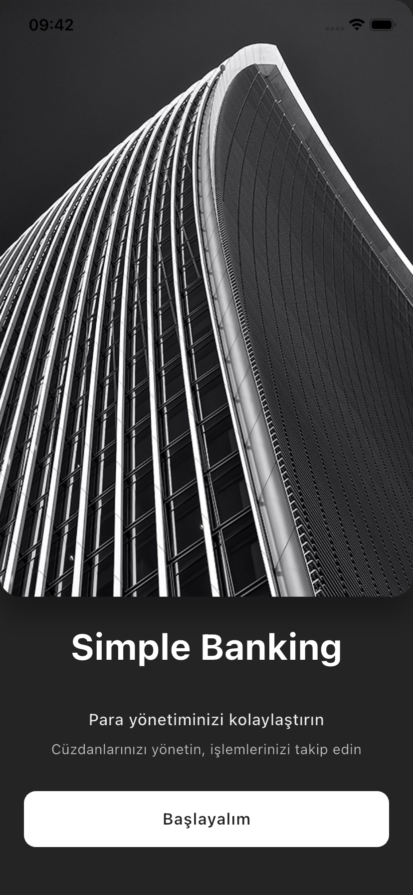
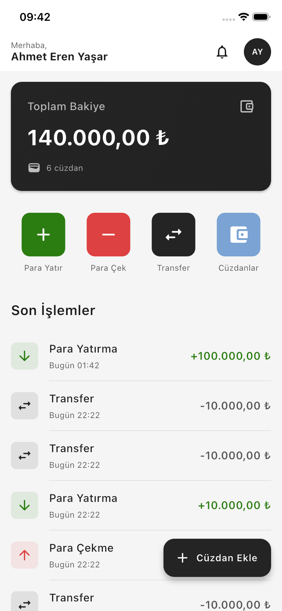

# 💰 Simple Banking System

A simple banking application built with Flutter that allows users to manage multiple wallets, track transactions, and perform financial operations with an intuitive interface.


## 📱 Screenshots

### Splash Screen
<!-- Add your splash screen screenshot here -->


### Home Screen
<!-- Add your home screen screenshot here -->


## ✨ Features

### 💳 Wallet Management
- **Multiple Wallets**: Create and manage multiple wallets with custom names
- **Category-based Organization**: Organize wallets by categories (Personal, Business, etc.)
- **Real-time Balance**: Track total balance across all wallets
- **Wallet Details**: View detailed transaction history for each wallet

### 💸 Financial Operations
- **Deposit Money**: Add funds to any wallet with validation
- **Withdraw Money**: Remove funds with insufficient balance protection
- **Transfer Between Wallets**: Seamlessly transfer money between your wallets
- **Transaction History**: Complete history of all financial operations

### 🎨 User Experience
- **Material Design 3**: Modern and clean UI following Material Design guidelines
- **Turkish Locale Support**: Localized date/time and currency formatting
- **Persistent Storage**: All data saved locally using SharedPreferences
- **Loading States**: Smooth loading indicators and transitions
- **Error Handling**: User-friendly error messages and validations

### 📊 Transaction Features
- **Transaction Types**: Support for deposits, withdrawals, and transfers
- **Timestamp Tracking**: Each transaction records date and time
- **Balance Validation**: Prevents overdrafts and invalid operations
- **Transaction Icons**: Visual indicators for different transaction types

## Architecture

```
lib/
├── models/           # Data models (User, Wallet, Transaction, Category)
├── screens/          # UI screens (Home, Splash, WalletDetails, WalletsList)
├── widgets/          # Reusable widgets
│   ├── common/       # Shared components (Dialogs, Forms, Actions)
│   └── ...           # Feature-specific widgets
├── services/         # Business logic (StorageService)
└── utils/            # Utilities (Constants, Formatters, Theme, Exceptions)
```

### Design Patterns
- **Singleton Pattern**: StorageService for centralized data management
- **Factory Pattern**: JSON serialization/deserialization
- **Builder Pattern**: Widget composition
- **Repository Pattern**: Data access abstraction

### SOLID Principles
- **Single Responsibility**: Each class has one clear purpose
- **Open/Closed**: Extensible through inheritance without modification
- **Liskov Substitution**: Proper inheritance hierarchy
- **Interface Segregation**: Focused interfaces
- **Dependency Inversion**: Dependencies on abstractions

## Tech Stack

### Core Technologies
- **Flutter SDK**: 3.9.2+
- **Dart**: 3.9.2+


## 🚀 Getting Started

### Prerequisites
- Flutter SDK 3.9.2 or higher
- Dart SDK 3.9.2 or higher
- Android Studio / VS Code with Flutter extensions
- iOS Simulator (for macOS) or Android Emulator

### Installation

1. **Clone the repository**
   ```bash
   git clone https://github.com/ahmeterenyasar/flutterSimpleBankingSystem.git
   cd flutterSimpleBankingSystem
   ```

2. **Install dependencies**
   ```bash
   flutter pub get
   ```

3. **Run the application**
   ```bash
   flutter run
   ```

### Build for Production

#### Android
```bash
flutter build apk --release
```

#### iOS
```bash
flutter build ios --release
```

## 📖 Usage Examples

### Creating a New Wallet
1. Tap the **+** floating action button on the home screen
2. Enter wallet name
3. Select a category
4. Set initial balance (optional)
5. Tap **Confirm** to create

### Depositing Money
1. Tap **Deposit** in quick actions or wallet details
2. Select the target wallet
3. Enter amount
4. Tap **Confirm** to complete

### Transferring Money
1. Tap **Transfer** in quick actions
2. Select source wallet
3. Select destination wallet
4. Enter amount
5. Tap **Confirm** to transfer

### Withdrawing Money
1. Tap **Withdraw** in quick actions or wallet details
2. Select wallet
3. Enter amount (cannot exceed balance)
4. Tap **Confirm** to complete

## 🎨 Customization

### Theme Configuration
Modify `lib/utils/theme.dart` to customize:
- Colors
- Typography
- Button styles
- Input decorations
- Card styles

### Constants
Update `lib/utils/constants.dart` for:
- Dimension values
- Text content
- Color palette
- App configuration

## 👨‍💻 Author

**Ahmet Eren Yaşar**
- GitHub: [@ahmeterenyasar](https://github.com/ahmeterenyasar)

## 📄 License

This project is licensed under the MIT License - see the [LICENSE](LICENSE) file for details.

---